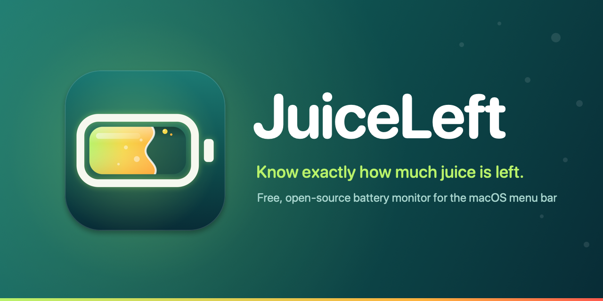
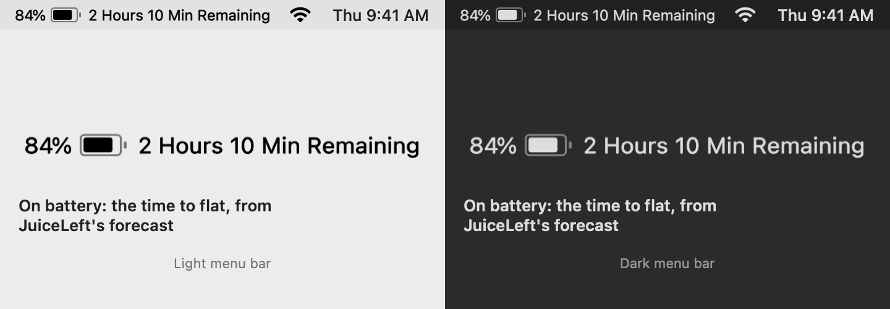
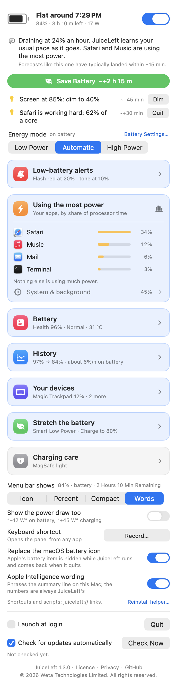
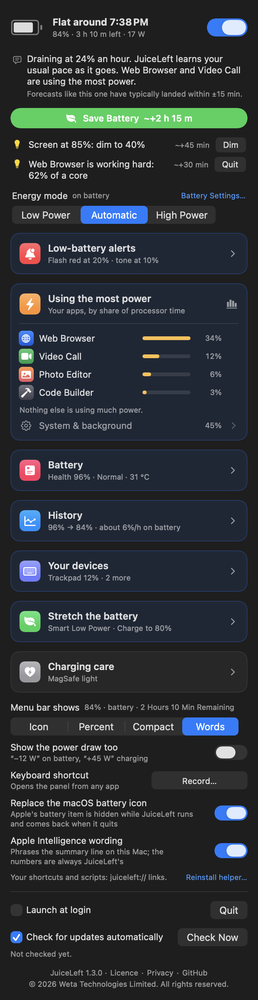
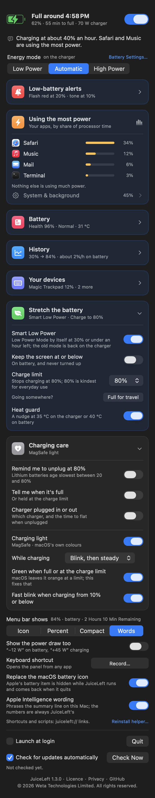
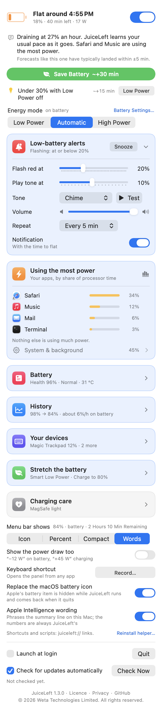
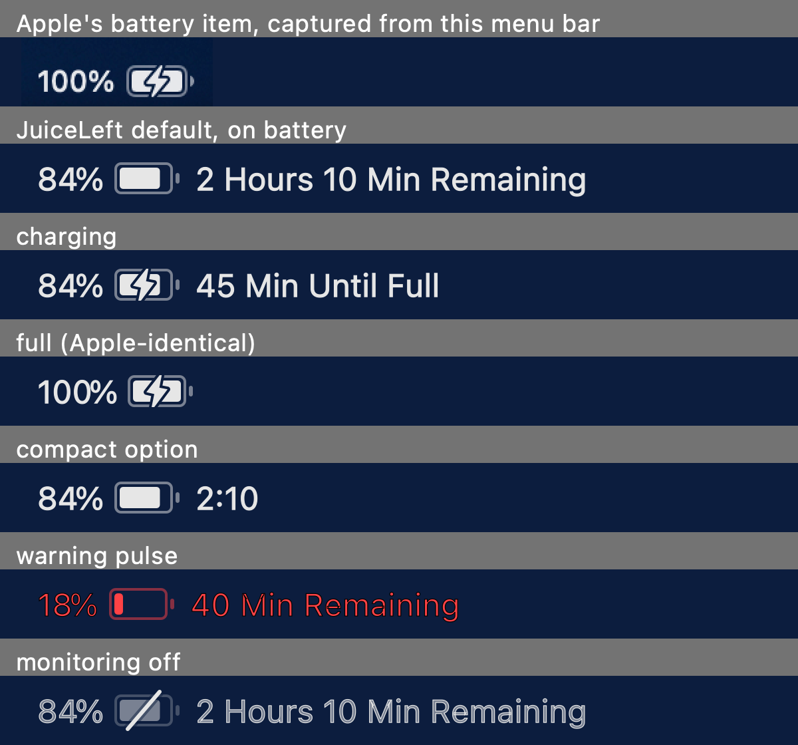

<p align="center">
  
</p>

<p align="center">
  
  
  
  <a href="https://github.com/Weta-Technologies/JuiceLeft/releases/latest"></a>
  <a href="LICENSE"></a>
</p>

<p align="center">
  <a href="https://github.com/Weta-Technologies/JuiceLeft/releases/latest/download/JuiceLeft.pkg"></a>
  <br>
  <sub>macOS 13+ · Apple Silicon · free · Weta Technologies Limited · GitHub: <a href="https://github.com/CyborgFingers">CyborgFingers</a></sub>
</p>

**JuiceLeft** puts the time until your Mac goes flat in the menu bar — in the exact spot, and the exact look, of Apple's own battery icon — and stretches that time. Its forecast learns from its own misses and tells you how accurate it has been. It pulses red when the battery gets low and plays a tone when it gets lower. One **Save Battery** click buys you hours; tips with one-click fixes show what is costing you power; and it can set Apple's own charge limit, switch to Low Power Mode by itself, cap the screen on battery, watch the pack's temperature and coach your charging habits. No root for any of that except the energy modes, which go through a tiny helper you approve once.

<p align="center">
  
</p>

## Features

- **Apple's battery icon, with the time left** — JuiceLeft's item is drawn to Apple's geometry (the 22 × 12 pt glyph, the 12 pt text, the same gaps) and reads `84% [battery] 2 Hours 10 Min Remaining`; `45 Min Until Full` while charging; just `100% [battery]` when full. On launch it hides Apple's battery item — the same per-host Control Center setting that *System Settings › Control Center › Battery › Show in Menu Bar* flips — and takes Apple's saved position, so it appears where the battery was. Quit, and Apple's item comes back exactly as it was. A switch in the panel turns the swap off.
- **A forecast, not a guess** — three opinions of your drain rate are blended: the gas gauge's live current, the trend of the last 20 minutes, and what *you* typically drain at this time of day. Each is weighted by how wrong it has recently been; every 5 minutes the forecast checks itself and re-weights. [Details below.](#how-the-forecast-works)
- **It tells you how accurate it is** — every forecast made during a discharge is scored, once you plug in, against when the level really arrived. After a couple of discharges the panel says *"Forecasts like this one have typically landed within ±15 min."*
- **Warning level (default 20 %)** — on battery, the whole item pulses red until you plug in. **Alert level (default 10 %)** — a tone: JuiceLeft's own chime or any macOS alert sound, at a volume you set, once or every 2 / 5 / 10 minutes until the charger goes in. Optional macOS notifications at both levels, with the time to flat. Snooze for 30 minutes. A 2 % hysteresis means a 10 ↔ 11 % bounce can never sound the tone twice.
- **Click for the panel, press and hold to arm or disarm** — a click on the item (or right-click / ⌃-click) opens the panel; press and hold it for a third of a second to turn monitoring on or off without opening anything — the glyph gains or loses its slash and the trackpad taps back. Rest the pointer on the item and a card shows the time in words, *Flat around 4:22 PM*, the percent and the alert state. A **keyboard shortcut** of your choosing (off until you record one) opens the panel from any app, and closes it again — a system-wide hot key, no Accessibility permission.
- **Save Battery** — one green button, with what it will gain (*~+3 h 15 m*): Low Power Mode, the screen down to 40 % (never up), the keyboard light off. One **Undo** puts every one of them back exactly; plugging in does too. The gain is an estimate (marked *~*) from typical Macs until JuiceLeft has measured what brightness and Low Power actually save on *your* Mac — then it is your own number.
- **Tips with one-click fixes** — only what is detected right now, biggest saving first, at most two: a screen at 70 % or brighter (*Dim*), the keyboard light on in a lit room (*Turn off*), under 30 % with Low Power off (*Low Power*), an app hogging a core (*Quit*), a USB device drawing 250 mA or more (unplug it when you can).
- **Energy mode** — *Low Power · Automatic · High Power* for the power source in use, the same setting as *System Settings › Battery*, from the panel. Setting it needs root, so it goes through a [short shell script](juiceleft-helper.sh) installed as a root launchd job from the panel's one-time setup — one macOS prompt, your password or Touch ID — after which nothing ever asks again (a new version's helper installs itself, signed); nothing but exactly `b|c` × `0|1|2` ever reaches `pmset`.
- **Stretch the battery** — **Smart Low Power** (on by default once the helper is installed): Low Power Mode by itself at 30 % or under an hour left, the old mode back on the charger, and it stands down if you change the mode yourself. **Keep the screen at or below** a cap on battery (off by default; 20–80 %; only ever turns the screen down, and puts it back on the charger). **Charge limit** on macOS 26.4+: Apple's own *Charge Limit* from *System Settings › Battery*, 80–100 %, with **Full for travel** for one full charge (the limit comes back after the next unplug, or after a day). **Heat guard**: a nudge — and a notification — at 35 °C on the charger or 40 °C on battery, with what to do.
- **Health coach** — inside the Battery card: how much of the last three days the battery sat at 95 %+ on the charger, cycles per week, the health trend per month, a storage tip, and a one-tap *Set 80%* for the charge limit.
- **Using the most power** — *your* apps (ordinary and menu-bar apps, not the system's agents), the top five by share of the processor time in use, helpers folded into the app that owns them (a browser's helpers count as the browser), and a *System & background* line for the rest with the top few behind a disclosure. Each app row has a ✕ **Quit** button: a graceful quit first, so the app's own save prompts protect unsaved work; if it is still there 5 s later you get **Force Quit** behind one confirmation.
- **Battery health** — Apple's own health figure (the one *System Settings › Battery* shows) as the headline, then condition, cycle count against the design count, the cells' measured capacity and today's usable full charge against the design capacity, temperature, voltage, what the charger can supply, watts flowing into or out of the battery, total system draw, and macOS's own estimate beside JuiceLeft's for comparison — straight from the gas gauge, no root.
- **A plain-English line** — *"Draining at 14 % an hour, easier than your usual 20 % for this time of day. Your browser and a video call are using the most power."* On macOS 26 with Apple Intelligence turned on, the on-device model phrases this line from JuiceLeft's own numbers, and every number it writes is checked against them — it can never invent one. Everywhere else, and whenever the model declines, the plain template stands. [More below.](#apple-intelligence)
- **History** — the level as a chart over the last 12 hours, 24 hours or 3 days (blue on battery, green charging, the warning level dashed, the alert level shaded, a gap where the Mac slept), with the window in one line: *100% → 84% · about 8%/h on battery*. Kept on your Mac, per minute, three days, a few hundred KB — nothing leaves it.
- **Your devices** — the batteries of the Bluetooth mice, keyboards and trackpads connected to the Mac (read from the IORegistry: no permission, nothing installed), most-drained first, and — off by default — a notification when one gets low, at a level you pick, once per charge. The card only appears while something with a battery is connected. Devices that don't publish a level to macOS this way (AirPods, for one) aren't listed.
- **Charging care** (all off by default) — a reminder to unplug at 80 %, a notice when full (or, with a charge limit on, when the battery is *Held at 80%*), and a notice on every plug and unplug (which charger, and the time to flat). And a passive word when the charger is too weak — *Charging slowly — 20 W charger* in the card and in the plug notice — so a phone brick never gets mistaken for a slow battery.
- **Menu bar shows** *Icon*, *Percent* (Apple's look), *Compact* (`84% [battery] 2:10` — the time alone, charging too) or *Words* (the default); optionally the power draw too — `· −12 W` on battery, `· +45 W` charging — after the time (off by default, so the default stays exactly Apple's). **Launch at login** (on by default once it is in Applications). No Dock icon, no analytics, no network beyond the update check.
- **Your shortcuts and scripts** — a `juiceleft://` URL scheme with a short whitelist: `juiceleft://savebattery?on=1` (`on=0` undoes), `juiceleft://mode?set=low|automatic|high`, `juiceleft://topup` (charge to full once), `juiceleft://monitoring?on=0`, `juiceleft://snooze`. Each runs the same action as the panel with the same guards; an unknown command, a stray parameter or a bad value does nothing at all. Bind one to a shortcut of your own, a hotkey, or `open juiceleft://mode?set=low` in a script.
- **Updates itself** — checks GitHub about once a day (you can turn that off), shows an *Update available* card in the panel and a line on the hover card (the menu-bar item stays exactly Apple's), and **Update Now** installs the signed update and relaunches with your settings and history intact. [Details below.](#updates)
- One panel with a live status header, a card per topic, tooltips on everything, full keyboard and VoiceOver support; it respects Reduce Motion (a steady red instead of the pulse, no transitions) and Increase Contrast.

## Screenshots

| On battery (light) | On battery (dark) |
| :---: | :---: |
|  |  |

| Charging (dark) | Below the warning level (light) |
| :---: | :---: |
|  |  |

<p align="center">
  
  <br>
  <sub>Apple's item, captured from a real menu bar, above JuiceLeft's — drawn to the same geometry.</sub>
</p>

## How it works

### The menu-bar item

The item is one image laid out like Apple's: the percent in the 12 pt system font, the 22 × 12 pt battery glyph with its 1 pt outline at half strength, the charge inset 2 pt, a rounded terminal, the charging bolt cut out of the charge with a halo — then the time. It is a template image, so it matches light and dark menu bars. The spelled-out time is rounded to five minutes and *steadied*: it only moves when the new value differs by ten minutes or more, or has come up twice in a row, so it never flip-flops. Until there is a forecast it says *Estimating…*.

If the menu bar gets full, JuiceLeft shortens itself so no icon is hidden behind the camera: the moment another app's item lands under the notch, the words give way to the compact form, and they come back only when they would fit again.

**Replacing Apple's item.** Control Center keeps a per-host preference, `Battery`, that *System Settings › Control Center* sets to `24` for "don't show in the menu bar" and picks up live. JuiceLeft sets the same value on launch (remembering what was there), copies Apple's saved menu-bar position (`NSStatusItem Preferred Position Battery`) to its own item so it lands in the same place, and on quit puts the original value back — if you had already hidden Apple's item yourself, it stays hidden. Turning *Replace the macOS battery icon* off in the panel does the same at once, and JuiceLeft leaves the setting alone from then on. If the menu bar runs out of room, JuiceLeft falls back to the compact form and tries the full one again every few minutes.

**The red pulse.** Below the warning level, on battery, the whole item — glyph and text — pulses red: a 1 Hz cosine between full and 50 % red, four frames a second, drawn in colour so it reads the same on any menu bar. Nothing is redrawn while nothing changes; the pulse pauses while the screens sleep; under Reduce Motion it is a steady red. Monitoring off dims the item to half and puts a slash through the glyph; no battery at all is a dash.

### How the forecast works

macOS's own "time remaining" reacts to every change in load, so it swings with each tab you open. JuiceLeft's forecast rests on a blend of three opinions of the drain rate, in percent of a full charge per hour:

1. **Live** — the gas gauge's current right now, smoothed over the last 5 minutes.
2. **Trend** — a straight line fitted to the last 20 minutes of the level curve (it needs 3 minutes and 3 samples before it has an opinion).
3. **Prior** — what *you* typically drain at this time of day: six 4-hour slots, weekdays and weekends kept apart, plus an overall figure used until a slot has seen three observations.

Every opinion is weighted by the inverse of its recent error. Every 5 minutes a check is filed; 20 minutes later the rate each opinion predicted is scored against what the level really did, and the weights move. The same verdict teaches the prior, and a bias term soaks up any consistent lean (capped at a quarter of the rate). The time to flat is simply the level divided by the blended rate.

**Accuracy** is scored when a discharge ends (you plug in): every forecast made during it predicted when the level it ended at would arrive, and the typical miss — as a share of the horizon — is what the panel shows for a forecast that far out, once two discharges have been scored. If the Mac slept mid-discharge, nothing is scored; the curve on either side of a sleep can't be compared.

While **charging**, the forecast uses macOS's own time-to-full when it has one (it knows the taper near the top), else the rate of the charging curve.

The learner, what JuiceLeft has measured about your Mac's savings, a daily line of cycles and health for the coach, and a per-minute curve of the last three days all live in `~/Library/Application Support/JuiceLeft/history.json` (a few hundred KB at most, written every five minutes and at quit), so everything it has learned carries on between launches.

### Save Battery, the tips, and what they are worth

Save Battery turns on Low Power Mode (through the helper, if it is installed — the first click installs it with one admin prompt), turns the built-in screen down to 40 % if it is brighter, and turns the keyboard backlight off (and its ambient-light adjustment, so it can't creep back up). It remembers each value it changed — on disk, so Undo still works after a relaunch — and *Undo*, or the charger going in, puts them all back exactly.

The gain shown on the button, and beside each tip, comes from a small model of what a change saves. Out of the box it uses cautious defaults: the display's draw climbs steeply with brightness (∝ brightness<sup>1.6</sup>), Low Power trims about 15 %, the keyboard light a couple of percent, a busy core about 2 W — and no default claim may exceed 30 % of the drain, nor all of them together 40 %. Such gains are marked with a *~* and rounded to the quarter hour. Meanwhile, every five minutes on battery, JuiceLeft records the drain against the mean brightness and whether Low Power was on, and fits a tiny ridge regression to those windows. Once it has two dozen windows with real spread in brightness and both Low Power states — and the coefficients have the right sign — its own numbers take over and the *~* goes away.

Tips are detected only while the panel is open, from the same facts: brightness, the keyboard light and the ambient light sensor, Low Power Mode, the top app's share of the processor and how much of a core it is using, and what external USB devices are drawing from the bus.

### Energy modes and the helper

Energy modes are `pmset -b|-c powermode 0|1|2` (Automatic, Low Power, High Power, per power source), and only root can set them. Reading is free (`pmset -g custom`), so the panel always shows the real state, re-read once a minute while it is open. Setting goes through [`juiceleft-helper.sh`](juiceleft-helper.sh). The Installer package installs it under its own admin prompt, so it is there before the menu-bar item first appears; a copy built from source gets the panel's one-time setup card (or a *Set up…* button beside the energy-mode picker and the charging light) instead — either way a single macOS authorization prompt, your password or Touch ID, installs everything JuiceLeft will ever need as root. From then on nothing asks again — a new version's helper files are installed by the helper itself, and only when they carry a manifest signed with the Weta Technologies publisher key (see [Updates](#updates)). Until it is set up, energy modes, Smart Low Power and the charging light simply stay off:

1. The app writes one line — `b 1` (battery, low power), `c 0` (adapter, automatic), … — to `/Library/Application Support/JuiceLeft/powermode`, a file owned by you in a root-owned folder.
2. launchd runs the helper on every write; it reads the first line and runs the matching `pmset`. **Nothing but exactly `b|c` × `0|1|2` ever reaches `pmset`**; anything else is ignored, as is a symlinked request file.
3. A request is applied once — its modification time is remembered — so a reboot or a re-run never re-imposes an old choice over one you made in System Settings.

The app checks that the installed helper is byte-for-byte identical to the one in its bundle before trusting it. Nothing automatic — Smart Low Power, the brightness cap, Save Battery's undo — ever raises a prompt: they simply wait for the helper. [`test-helper.sh`](test-helper.sh) runs the helper against a fake `pmset`, no root needed.

### Charge limit

On macOS 26.4 and later, Apple silicon Macs have a *Charge Limit* in *System Settings › Battery › Charging*. JuiceLeft reaches the same setting in-process, through the smart-charge client Apple's own UI uses — no root, no helper, no SMC keys (which newer firmware has removed). The firmware holds the limit and still tops up to 100 % now and then to keep the gauge honest; macOS allows 80 % to 100 %, so those are the steps offered. *Full for travel* is Apple's "charge to full now": one full charge with the limit untouched, cleared by JuiceLeft at the next unplug or after a day on the charger. Where macOS is 26.4+ but doesn't offer the limit to JuiceLeft, the panel links to Battery Settings instead.

### Alerts

The rules are pure and small ([`Alerts.swift`](Alerts.swift)). On battery, each level latches on the way down and only releases 2 % above it. The tone plays once on entering the alert level, again every *Repeat* interval while still there (or only once, if you prefer), and again when a snooze runs out; a snooze silences the flash too. The charger going in — or turning monitoring off — clears everything and re-arms. The tone is JuiceLeft's own bell-like chime (G5 · E5 · C5, twice, synthesised in memory) or any of macOS's alert sounds, played through the normal output at the system volume scaled by the app's own slider.

### Using the most power

Processor time is the best per-app proxy for battery use that a Mac exposes without root. While the panel is open, JuiceLeft reads every process's user + system CPU time through `libproc` (`proc_pidinfo`) every 3 seconds, groups the difference by the outermost `.app` on each process's path, and lists your apps — the ones you launched, ordinary or menu-bar — with their share of everything measured (so the numbers add up to 100), each at least 1 % of a core. GPU and networking aren't billed per process without root, and neither are root-owned system processes such as WindowServer, so those roll up into *System & background*, which you can open to see the top few. A button opens macOS's own process monitor for the full picture.

**Quit** sends the app an ordinary quit (`NSRunningApplication.terminate`), so a document app asks you to save exactly as if you had pressed ⌘Q. If the app is still running 5 seconds later, the row says *Still running* and offers **Force Quit**; confirming it (*Unsaved work is lost*) force-terminates the app. The system's own agents (the desktop, the Dock, Control Center and the rest), anything in `/System/Library`, background-only processes and JuiceLeft itself are never listed as yours, let alone offered a Quit button.

### Apple Intelligence

The one-line summary under the panel header is always generated from JuiceLeft's own numbers by a plain template. On **macOS 26 or later with Apple Intelligence turned on**, JuiceLeft also hands the same facts to the on-device Foundation Models framework and asks for one friendly sentence of at most 25 words. Before it shows the model's sentence it checks that every number in it already appears in the facts it was given; if the model added, rounded or invented anything, or isn't available, the template stands. A ✨ marks a sentence phrased by the model; a switch in the panel (only shown where the model is available) turns it off. Nothing leaves your Mac; the framework is weak-linked, so the same build runs on macOS 13–15 without it.

### What it reads

- `IOPowerSources` — percent, on-charger / charging / full, Low Power Mode, macOS's own time estimate: the same numbers as the menu bar's battery. Its notifications wake JuiceLeft on every plug, unplug and percent change; between them it samples every 30 s with a 5 s tolerance so macOS can coalesce the wake-ups.
- The `AppleSmartBattery` registry entry — Apple's `MaxCapacity` health figure, raw current and maximum capacity (so the forecast sees the level move between whole percents), the cells' `Qmax`, design capacity, cycle count and design cycle count, voltage, amperage, temperature, adapter watts and name, system power telemetry, and the permanent-failure flag.
- `libproc` — per-process CPU time, only while the panel is open.
- The built-in display's brightness (the private `DisplayServices` calls the brightness keys use), the keyboard backlight (the private `CoreBrightness` client the keyboard keys use), the ambient light sensor (through the HID event system) and external USB devices' bus power (from the IORegistry) — for Save Battery, the brightness cap and the tips.
- The IORegistry's HID battery entries (`AppleDeviceManagementHIDEventService`) — `BatteryPercent` and the product name of Bluetooth accessories — while the panel is open, and every ten minutes if the accessory alert is on.
- Control Center's preferences, for the icon swap; `pmset -g`, for the energy modes; and, on macOS 26.4+, the private `PowerUI` smart-charge client, for the charge limit.

## Install

### Download (easiest)

1. **[Download JuiceLeft.pkg](https://github.com/Weta-Technologies/JuiceLeft/releases/latest/download/JuiceLeft.pkg)** — always the latest release ([all releases](https://github.com/Weta-Technologies/JuiceLeft/releases)).
2. Open it: **Continue**, **Agree** to the licence, **Install**. macOS asks for your password or Touch ID **once**: that puts JuiceLeft into Applications and sets up its helper, and JuiceLeft opens in your menu bar — in Apple's battery spot — with energy modes and the charging light ready. Nothing asks again — not the app, and not later updates.

   The package and the app are Developer ID signed and notarized by Apple (the official builds are signed and notarized by Weta Technologies Limited — see [SECURITY.md](SECURITY.md) for how to check a download), so there is no Gatekeeper step and the app opens without a warning. Requires an Apple Silicon Mac with a battery running macOS 13 or later. Running the package again over an installed JuiceLeft (or a newer one) simply upgrades it; your settings and what it has learned are kept. (The 1.0 release was an unsigned drag-to-Applications DMG: if you still have that one, macOS 15 and later make you allow it under *System Settings → Privacy & Security → Open Anyway* — the package replaces it, and does not.)

### Build from source

You need Apple's command-line developer tools (`xcode-select --install`).

```bash
git clone https://github.com/Weta-Technologies/JuiceLeft.git
cd JuiceLeft
./build.sh install   # builds build/JuiceLeft.app, copies it to /Applications and launches it
```

`./build.sh` on its own just builds `build/JuiceLeft.app`. The app is ad-hoc signed; because you build it on your own Mac there is no download quarantine and no Gatekeeper prompt. `./make-pkg.sh` builds the Installer package (`build/JuiceLeft.pkg`) that is attached to each release: the app, the licence pane, and pre/post-install scripts ([`pkg/`](pkg/)) that quit a running copy properly (so Apple's battery item comes back), hand the app to the logged-in user, install the helper for them and open the app.

## First run

- Apple's battery icon disappears and JuiceLeft's item takes its place — same spot, same look, with the time left after it. The panel says so once. There is no Dock icon. **Click** the item for the panel; **press and hold** it to turn monitoring on or off. The panel shows that tip once too.
- Running from Applications, it registers itself as a **login item** on first launch (macOS may show a "background items added" notification). Untick *Launch at login* in the panel if you would rather not.
- It asks once whether it may post **notifications**. Say no and the red pulse and the tone still work; only the notification switches, the heat guard's notification and the charging-care notices do nothing.
- The forecast needs a few minutes of discharge before it has an opinion (*Estimating…* until then), and a couple of full discharges before it can tell you how accurate it is.
- Installed with the package, the helper behind energy modes and the charging light is already set up — the installer's prompt was the one. Built from source, the panel opens with a **one-time setup** card instead: **Set up now** brings one macOS prompt — your password, or Touch ID on Macs that have it — and nothing asks again; **Later** leaves those features off (each with its own *Set up…* button; *Smart Low Power* waits too, and says so under its switch) until you are ready. A *Reinstall helper…* link at the bottom of the panel is there if the helper is ever removed.
- On a Mac that could run **Apple Intelligence** but has it turned off, the panel also offers one line — *Turn on Apple Intelligence for plain-English battery tips* — with **Open Settings** (System Settings › Apple Intelligence & Siri) and **Not now**. JuiceLeft starts phrasing its summary line with it as soon as it is on; Macs that can't run it, and macOS before 26, never see the line.
- If you use a menu-bar organiser, or your menu bar is crowded next to the notch, the item may be hidden — look for it there.

## Usage

**Click** the menu-bar item (or **right-click** / **⌃-click** it) for the panel; Esc, another click on the item, or a click anywhere else closes it. **Press and hold** the item to turn monitoring on or off. **Rest the pointer** on it for the hover card. A **keyboard shortcut** you record in the panel opens and closes it from any app.

| Control | What it does |
| --- | --- |
| **Status header** | The glyph, tinted for the state; *Flat around 4:22 AM* or *Full around 9:10 AM*; the percent, time left, watts and Low Power Mode. Its switch is the same on/off as a press-and-hold on the menu-bar item. |
| **Summary line** | One sentence about what the battery is doing, and how far out forecasts like this one have typically landed. |
| **Save Battery** *~+3 h 15 m* | Low Power, screen to 40 %, keyboard light off, with what that gains. Then *Saving battery · screen 85% → 40% · keyboard light off · Low Power on* with **Undo**. Only on battery. |
| **Tips** | What is costing power right now, each with its gain and a one-click fix: *Dim*, *Turn off*, *Low Power*, *Quit*. |
| **Energy mode** | *Low Power · Automatic · High Power* for the source in use (High Power only on Macs that have it), with a *Smart Low Power* badge when JuiceLeft set it, and *Battery Settings…*. |
| **Low-battery alerts** (disclosure) | The header shows the state and, while flashing or sounding, **Snooze** (30 min) — or **Resume**. Inside: *Flash red at* (5–50 %), *Play tone at* (1 % up to the flash level), *Tone* with *Test*, *Volume*, *Repeat* (once / every 2, 5 or 10 min), *Notification*. |
| **Using the most power** | Your top five apps by share, live while the panel is open, each with a ✕ Quit button (then Force Quit if it won't go); *System & background* for the rest. The chart button opens macOS's own process monitor. |
| **Battery** (disclosure) | Health, condition, cycles, the capacities, temperature, voltage, charger and watts, macOS's own estimate, and the health coach. |
| **History** (disclosure) | The level over *12 hours*, *24 hours* or *3 days*, and what the window comes to in a line. |
| **Your devices** (disclosure) | Each connected accessory's battery with a bar; *Tell me when one gets low* and its level. Only shown while one is connected. |
| **Stretch the battery** (disclosure) | *Smart Low Power*, *Keep the screen at or below* (with its cap), *Charge limit* (macOS 26.4+) with *Full for travel*, *Heat guard*. |
| **Charging care** (disclosure) | *Remind me to unplug at 80 %*, *Tell me when it's full* (or held at the charge limit), *Charger plugged in or out*; the header says *Charging slowly — 20 W charger* when that is what's happening. |
| **Menu bar shows** | *Icon*, *Percent*, *Compact* or *Words*, with an example of each; *Show the power draw too* adds `· −12 W`. |
| **Keyboard shortcut** | *Record…*, then press the keys (⌘, ⌥ or ⌃ with a key, or a function key): the panel opens from any app, and closes on the same press. Esc keeps what was there, Delete removes it. |
| **Replace the macOS battery icon** | Off puts Apple's battery item back straight away and leaves it alone from then on. |
| **Apple Intelligence wording** | Shown only where the on-device model is available: lets it phrase the summary line. |
| **Launch at login** / **Quit** | Quit (⌘Q) puts Apple's battery item back and stops the alerts until JuiceLeft runs again; what it has learned is saved. |

Every control has a tooltip, everything works with the keyboard and VoiceOver, and the panel respects Reduce Motion and Increase Contrast. Whenever JuiceLeft does something by itself — Save Battery undone by the charger, Smart Low Power, the brightness cap, the heat guard — the panel says so.

## Updates

JuiceLeft checks GitHub for a newer release about 10 seconds after launch and then once a day — one plain request to `api.github.com` for the latest release, with no account and nothing about you or your Mac — and whenever you click **Check for Updates** in the panel. Untick **Check for updates automatically** to stop the daily check (the button still works). When there is one, the panel shows an *Update available* card with the version, the first lines of the release notes and a *What's new…* link, and the hover card under the menu-bar item gains a line saying so — the item itself stays exactly Apple's (macOS may also show a notification, if you allowed JuiceLeft notifications).

**Update Now** downloads `JuiceLeft.app.zip` from the release and checks its **Ed25519 signature** against the Weta Technologies publisher key built into the app — a download that doesn't verify is never unpacked. It then unpacks the zip beside the app, checks that the new bundle really is JuiceLeft at the advertised, newer version with a valid code signature, and hands over to a tiny script that waits for JuiceLeft to quit, swaps the two bundles with two renames (the old one is put back if anything fails) and relaunches. JuiceLeft quits normally, so Apple's battery item and the charging light are handed back first and taken over again by the new version. It all takes a couple of seconds. **Later** hides the card until the next check; **Skip** ignores that version.

Your settings (`~/Library/Preferences/io.github.cyborgfingers.juiceleft.plist`) and the learner's history (`~/Library/Application Support/JuiceLeft/`) live outside the app, so they survive, and so does *Launch at login*. If the update changes the helper, the installed helper takes the new files by itself: they come with a manifest signed with the same publisher key, which the root-owned helper verifies (signature, every file's hash, no downgrade) before installing anything, so there is no new prompt. If JuiceLeft can't replace itself where it is — in a folder you can't write to, say — the card says so and offers the download page instead (the package installs over the old version too).

## Uninstall

Quit JuiceLeft — that puts Apple's battery icon back. Then remove the helper (installed by the package, or by the panel's setup) and, if you installed with the package, its receipt:

```bash
sudo /bin/sh /Applications/JuiceLeft.app/Contents/Resources/juiceleft-helper.sh uninstall
sudo pkgutil --forget io.github.cyborgfingers.juiceleft.pkg
```

and move `/Applications/JuiceLeft.app` to the Trash. If you built from source, `./build.sh uninstall` does all of it. The helper's files are:

- `/Library/PrivilegedHelperTools/io.github.cyborgfingers.juiceleft.power.sh` (and `.led`, `.verify`, `.pub`, `.manifest` beside it)
- `/Library/LaunchDaemons/io.github.cyborgfingers.juiceleft.power.plist`
- `/Library/Application Support/JuiceLeft/`

If JuiceLeft is still listed under *System Settings → General → Login Items*, untick it there. If Apple's battery icon didn't come back (say JuiceLeft was force-killed), *System Settings → Control Center → Battery → Show in Menu Bar* is the switch, or `defaults -currentHost delete com.apple.controlcenter Battery`. To remove what it learned and its settings:

```bash
rm -r ~/Library/Application\ Support/JuiceLeft
defaults delete io.github.cyborgfingers.juiceleft
```

## Testing

```bash
./build.sh && build/JuiceLeft.app/Contents/MacOS/JuiceLeft --selftest
```

walks the alert rules down a discharge and back (latching, hysteresis, repeat, snooze, charger reset); runs the forecast on a perfect line; teaches the learner a synthetic user — five weekdays of a slow morning and a fast evening — and checks its priors converge, its first-sample forecast lands within 15 %, it follows when the evening pace changes, and a gas gauge that reads 50 % high loses its say; checks the menu bar's words and layout for every display style and the steadying; parses `pmset`'s output and the helper's request lines; runs the savings model cold and warm, the tips, the heat guard, the health coach, Smart Low Power's decisions, the brightness cap and the USB parsing; drives Save Battery, Undo, the charger's undo, the cap and the heat nudge on a fake Mac; checks settings migration (an older blob keeps its values and gets the new defaults; a newer one keeps and clamps them), the menu bar's optional power draw, the weak-charger rule, the history summary, accessory-battery parsing and the low-accessory latch, the URL scheme against good, bad and hostile input, app grouping and the quit rules, the Apple Intelligence number check and the first-launch nudge's gating (every availability status, dismissed or not), the click / hold / right-click decision, that the battery reads, the chime decodes and every item state draws; and finally the updater's pure parts — version ordering (1.10 > 1.9, tags with and without `v`, pre-releases ignored), the release-feed parser, Ed25519 verification with a throwaway key pair (good, tampered, wrong key), and the bundle-swap script on a fake app in a temp folder (a success, and a failure that must put the old app back).

```bash
build/JuiceLeft.app/Contents/MacOS/JuiceLeft --simulate            # a fake battery draining 1 % a second from 26 %
build/JuiceLeft.app/Contents/MacOS/JuiceLeft --simulate hold       # parks it at 15 %, flashing, for CPU measurements
```

lets you watch the warning flash at 20 %, the tone at 10 %, the charger-connected reset and the heat guard (the fake pack warms past 35 °C on the charger) without draining anything, printing what happens; it uses its own settings domain and history file, a fake screen and keyboard, and never installs the helper or touches Apple's battery icon. Add `--volume 0.2` to keep the tone quiet.

```bash
./test-helper.sh
```

runs the helper against a fake `pmset` and a fake light tool (no root needed) and checks that the three modes per source are applied, an applied request is never applied again, nothing but `b|c` × `0|1|2` reaches `pmset`, only the whitelisted lines reach the light tool, a symlinked request is ignored, and — with throwaway keys and a fake app bundle — that a signed helper update is installed exactly once, while a file changed after signing, a manifest signed with another key, a downgrade, an unsigned bundle, a symlinked request and a request that isn't an app path all leave the installed helper untouched.

```bash
./test-update.sh
```

runs the in-app updater end to end without GitHub: it serves a fake latest-release feed and a signed zip of this build re-versioned as 9.9.9 from a local web server, then runs a *copy* of the app from a temp folder with `--update-test <feed> <key> <log>`, which does exactly what Update Now does — check, download, verify, unpack, sanity-check, swap, relaunch — and proves the copy comes back as 9.9.9 with nothing left behind, that a zip signed with the wrong key and a tampered zip are refused with the copy untouched, and that your real settings never change. Your installed JuiceLeft is not involved.

## Security & privacy

- **No analytics, no accounts.** The only network activity is the [update check](#updates) — a plain request to GitHub for the latest release, about once a day, which you can turn off — and the download you start with Update Now. Nothing about you or your Mac is sent; the Apple Intelligence sentence is generated on device.
- **Updates are signed.** Every release's `JuiceLeft.app.zip` carries an Ed25519 signature made with the Weta Technologies publisher key; the app verifies it with the public key compiled in ([`cyborgfingers.pub`](cyborgfingers.pub)) before unpacking, then checks the bundle id, version and code signature of what it unpacked. Nothing from a download ever runs except that verified app.
- **The root helper** is a short, readable shell script that only ever runs `pmset -b|-c powermode 0|1|2` and passes whitelisted lines to the light tool. It is installed by `/bin/sh juiceleft-helper.sh install <user>` after the system's authorization prompt (Authorization Services, `system.privilege.admin` — the same sheet installers use, with Touch ID where macOS offers it), and the app checks that the installed copy is byte-for-byte identical to the one in its bundle before trusting it. Anything but an exact request is ignored, a symlinked request file is ignored, and a request is applied once. Any process running as your user could write the request file; the worst it can do is change your energy mode.
- **The helper updates itself only from signed files.** When a new version of JuiceLeft changes it, the app writes its bundle path to a request file; the root helper copies the files into a root-owned folder first, runs its own root-owned verifier (`juiceleft-verify`, compiled from [`tools/helper-verify.swift`](tools/helper-verify.swift)) against the root-owned copy of the publisher key — manifest signature, every file's hash, no downgrade — and only then installs them, each with a rename. Anything else is ignored, and the panel offers the setup card instead. The prompt at setup is therefore the only one there will ever be.
- **Everything else needs no root**: battery figures from `IOPowerSources` and the `AppleSmartBattery` registry entry; per-app energy from `libproc`; app quitting through `NSRunningApplication`; the icon swap through Control Center's preferences; the charge limit through the same in-process client Apple's UI uses.
- **Private APIs** are used for brightness (`DisplayServices`), the keyboard backlight (`CoreBrightness`), the ambient light sensor (`IOHIDEventSystemClient`) and the charge limit (`PowerUI`). They can change between macOS releases; each is optional, and the app carries on without whichever one is missing.
- **Quit is graceful by default.** The first press is an ordinary quit that lets the app save; force quit only appears after 5 seconds and behind a confirmation.
- **Notifications** are optional and asked for once. Nothing JuiceLeft does automatically — Smart Low Power, the brightness cap, undoing Save Battery on the charger — ever raises a password prompt.
- Settings live in `~/Library/Preferences/io.github.cyborgfingers.juiceleft.plist`; the learner, the savings model, the coach's daily log and the last three days of the level curve in `~/Library/Application Support/JuiceLeft/history.json`. Both are yours to delete. Accessory battery levels are read live and shown, never stored.
- **The URL scheme** accepts five whitelisted commands and nothing else; every parameter is validated and each command runs the same code as the panel's own control, with the same guards.
- The app is not sandboxed (it reads IOKit, the process table and the private frameworks above) and is ad-hoc signed; you can build it yourself in a few seconds.

## Credits

JuiceLeft is an independent implementation with no code or artwork copied from anywhere. The forecast model, the savings model, the alert rules, the chime, the icons and this page are all its own; the geometry of the menu-bar item was traced from Apple's, so that the swap is seamless, and the app icons in the *Using the most power* list belong to their apps.

## License

**JuiceLeft is copyright © 2026 Weta Technologies Limited. All rights reserved. Developed by Weta Technologies Limited · GitHub: [CyborgFingers](https://github.com/CyborgFingers).**

JuiceLeft is **freeware**: you may download and use it free of charge on any Macs you own or control, for personal or business use. You may not modify, decompile, redistribute, sell or host it; please share the [official download](https://github.com/Weta-Technologies/JuiceLeft/releases/latest) instead. The source is published so you can see exactly what JuiceLeft does. It is not open source, and viewing it gives no rights beyond the licence. The installer asks you to accept the licence before installing.

- [Licence agreement](LICENSE) (governed by New Zealand law)
- [Privacy policy](PRIVACY.md): JuiceLeft collects nothing, and its Apple Intelligence tips run on your Mac
- [Trademark policy](TRADEMARKS.md) · [Security policy](SECURITY.md) · [Contributing](CONTRIBUTING.md) · [Notices](NOTICE.md)


Apple, Mac, macOS, MagSafe and Apple Intelligence are trademarks of Apple Inc. JuiceLeft is not affiliated with or endorsed by Apple Inc.
